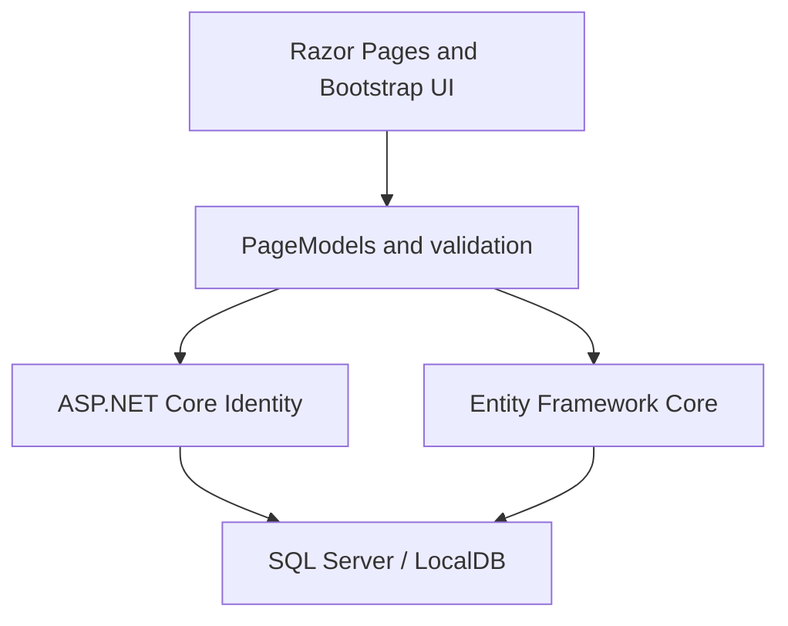

# Library Management System

[](https://dotnet.microsoft.com/en-us/download/dotnet/7.0)
[](https://learn.microsoft.com/aspnet/core/razor-pages/)
[](https://www.microsoft.com/sql-server/)

**Library Management System** is a server-rendered catalogue and reservation application built with **ASP.NET Core Razor Pages**. It gives visitors a searchable collection of books, DVDs, and CDs; lets authenticated members reserve available items and review their current loans; and provides staff-oriented workflows for catalogue maintenance, booking oversight, returns, and item history.

The project demonstrates a complete data-backed web workflow using **Entity Framework Core**, **SQL Server**, and **ASP.NET Core Identity**, with seeded catalogue, account, active-loan, and historical-loan data for local exploration.

## Project Walkthrough

[](https://deanprogramming.github.io/CV/images/LibrarySystemMP4.mp4)

**[Watch the project walkthrough](https://deanprogramming.github.io/CV/images/LibrarySystemMP4.mp4)**

## Overview

The application models the everyday flow of a small lending library. Guests can browse the catalogue, members can reserve available stock, and staff users can manage items and complete returns. Availability is calculated from active reservation records, while completed reservations remain available as lending history.

The catalogue is seeded with **38 sample items**—26 books, 7 DVDs, and 5 CDs—alongside demonstration users and reservation records. Search criteria and page position are carried through catalogue actions so users can return to the results they were viewing.

## Features

### Catalogue search and discovery

- Browse books, DVDs, and CDs as a guest or signed-in user
- Search by partial title or author
- Filter by genre and media type
- Filter for items published on or after a selected date
- Browse paginated results in groups of five
- Open a dedicated details page for each catalogue item

### Availability and reservations

- Calculate current availability from active reservation records
- Display expected return dates for unavailable items
- Highlight reservations whose return date has passed
- Allow signed-in members to reserve an available item
- Assign a one-month return period to new reservations
- Preserve completed reservations as lending history

### Member experience

- Sign in through ASP.NET Core Identity
- View all current reservations associated with the signed-in account
- See item details, expected return dates, and overdue status
- Use seeded, email-confirmed accounts for local demonstration

### Staff-oriented workflows

- Add, inspect, edit, and delete catalogue records
- View all active reservations
- Filter active loans by title, author, genre, media type, publication date, borrower ID, or borrower name
- Confirm an item return and make it available again
- Review the lending history for an individual catalogue item
- Surface staff navigation and controls through the custom `IsAdmin` account flag

## Core Workflows

### 1. Find an item

The catalogue page builds an Entity Framework query from the selected title, author, genre, media type, and publication-date filters. Results are paginated before availability and return-date information is added for the current page.

### 2. Reserve available stock

A signed-in member selects an available item and confirms the reservation. The application creates an active reservation associated with the member's Identity user ID and sets its expected return date to one month from the booking date.

### 3. Review member bookings

The member-bookings page scopes active reservation records to the signed-in user, joins them back to catalogue entries, and displays the expected return and overdue state for each item.

### 4. Process a return

The staff interface lists active reservations and supports catalogue and borrower filters. Confirming a return marks the reservation as inactive rather than deleting it, preserving the record for the item's lending history.

## System Architecture



The application is organised into the following areas:

1. **Presentation layer**
   - Razor Pages and PageModels
   - Bootstrap, CSS, JavaScript, and jQuery validation
   - Separate member and staff-oriented navigation paths

2. **Application layer**
   - Catalogue search, filtering, and pagination
   - Availability calculation and reservation creation
   - Member booking summaries
   - Staff return and history workflows

3. **Data and identity layer**
   - Entity Framework Core context and migrations
   - SQL Server LocalDB development database
   - ASP.NET Core Identity with a custom `ApplicationUser`
   - Startup seeders for catalogue, reservation, and account data

## Technology Stack

| Area | Technology |
| --- | --- |
| Web application | .NET 7, ASP.NET Core Razor Pages |
| Authentication | ASP.NET Core Identity with a custom user model |
| Data access | Entity Framework Core 7 |
| Database | SQL Server; SQL Server LocalDB by default |
| Front end | Razor, HTML, CSS, JavaScript, Bootstrap, jQuery validation |
| Development data | EF Core migrations and startup seeders |

## Data Model Highlights

| Entity | Responsibility |
| --- | --- |
| `ApplicationUser` | Identity account with the member's name, date of birth, and staff-access flag |
| `BookTable` | Shared catalogue record containing media type, title, author, genre, publication date, and description |
| `BookReservations` | Lending record connecting an item and Identity user, with active status and expected return date |

An inactive reservation represents a completed loan, allowing the same reservation table to support both current availability and historical reporting.

## Authentication and Data Handling

- ASP.NET Core Identity manages account creation, password hashing, sign-in, and account pages
- Accounts are configured to require confirmation; the seeded demonstration accounts are pre-confirmed
- The custom Identity user stores a display name, date of birth, and `IsAdmin` flag
- Data annotations validate required catalogue fields, accepted string lengths, and dates
- HTTPS redirection is enabled, with HSTS outside development
- The database connection is supplied through standard ASP.NET Core configuration

The current staff/member split is implemented through application checks and conditional UI. See [Current Limitations and Next Steps](#current-limitations-and-next-steps) before treating the project as deployable.

## Seeded Demonstration Data

After the migrations have created an empty database, the application seeds its catalogue, reservation history, and Identity accounts at startup.

Two useful local demonstration accounts are:

| Access | Email | Password |
| --- | --- | --- |
| Staff | `Admin@Admin.com` | `Admin!1` |
| Member | `UserOne@UserOne.com` | `UserOne!1` |

## Running the Project Locally

### Prerequisites

- [.NET 7 SDK](https://dotnet.microsoft.com/en-us/download/dotnet/7.0)
- SQL Server or SQL Server LocalDB
- [`dotnet-ef`](https://learn.microsoft.com/ef/core/cli/dotnet) compatible with Entity Framework Core 7

The checked-in connection string uses SQL Server LocalDB, which is normally available on Windows through Visual Studio or SQL Server Express.

### 1. Clone and restore

```bash
git clone https://github.com/DeanProgramming/NetCoreLibrarySystem.git
cd NetCoreLibrarySystem
dotnet restore
```

If `dotnet-ef` is not already installed, install a compatible tool version:

```bash
dotnet tool install --global dotnet-ef --version "7.*"
```

### 2. Create the local database

Apply the committed Entity Framework Core migrations before starting the application:

```bash
dotnet ef database update \
  --project DeanHLibrarySite/DeanHLibrarySite.csproj \
  --startup-project DeanHLibrarySite/DeanHLibrarySite.csproj
```

The sample records and demonstration accounts are inserted when the application first starts against the empty migrated database.

### 3. Run the application

```bash
dotnet run --project DeanHLibrarySite/DeanHLibrarySite.csproj
```

Open the address printed by ASP.NET Core in the terminal. The checked-in launch profiles use `http://localhost:5062` and `https://localhost:7291`.

### 4. Explore the workflows

- Browse and filter the catalogue without signing in
- Sign in as `UserOne@UserOne.com` to view the member journey
- Sign in as `Admin@Admin.com` to view the staff-oriented catalogue and return workflows

## Configuration

| Setting | Purpose | Required |
| --- | --- | --- |
| `ConnectionStrings:DeanHLibrarySiteContext` | SQL Server connection string used by Entity Framework Core | Yes |
| `ASPNETCORE_ENVIRONMENT` | Selects Development or non-Development middleware behaviour | No |

To use a SQL Server instance other than the checked-in LocalDB default, override the connection string through ASP.NET Core configuration. For example, the equivalent environment-variable name is `ConnectionStrings__DeanHLibrarySiteContext`. Do not commit real database credentials.

## Project Structure

| Path | Contents |
| --- | --- |
| `DeanHLibrarySite/Areas/Identity` | Scaffolded registration, login, confirmation, recovery, and account-management pages |
| `DeanHLibrarySite/Data` | Entity Framework Core database context |
| `DeanHLibrarySite/Migrations` | SQL Server schema migrations |
| `DeanHLibrarySite/Models` | Catalogue, reservation, legacy user, and seed-data models |
| `DeanHLibrarySite/Pages/Books` | Catalogue browsing, details, reservations, member bookings, and CRUD pages |
| `DeanHLibrarySite/Pages/StaffControls` | Active-loan filtering, returns, and item history |
| `DeanHLibrarySite/wwwroot` | CSS, JavaScript, Bootstrap, jQuery, and static assets |

## Design Documentation

The original design document covers the project's planned screens, data, and workflows:

**[Open the Library System design document](https://deanprogramming.github.io/CV/Library%20System%20Design%20Doc.pdf)**

## Current Limitations and Next Steps

This repository is a portfolio and learning project rather than a production-ready library platform. The most valuable next steps are:

- enforce member and staff permissions with server-side authorization policies on every protected page and handler
- add automated unit and integration tests plus a build-and-test GitHub Actions workflow

## Author

Built by **Dean Holland** as a personal software-development portfolio project.

GitHub: [DeanProgramming](https://github.com/DeanProgramming)
